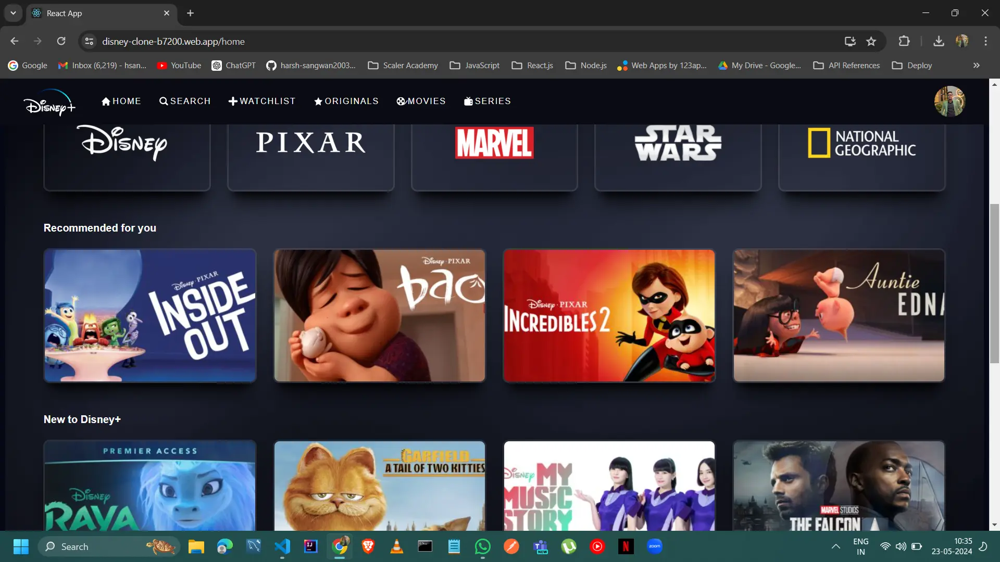

# Disney Clone

This is a Disney Clone app built with React.js, Firebase, Styled Components, and Redux. It allows you to browse Disney content, view details, and manage your favorite shows and movies.

## Live Demo

Check out the live demo of this app [here](https://disney-clone-b7200.web.app/).



## Features

- Login with Google
- View movie details (title, overview, release date, rating, etc.)
- Discover popular movies
- Responsive design with Styled Components

## Technologies Used

- React
- Styled Components
- Redux-Toolkit
- React-Redux
- Firebase
- React Router DOM

## Usage

### Clone and Run

1. Clone the repository:

```bash
git clone https://github.com/harsh-sangwan2003/100-days-web-dev/tree/main/React%20JS/Projects/disney-clone.git
```

2. Navigate to the project directory:

```bash
cd disney-clone
```

3. Install dependencies and start the development server:

```bash
npm install && start
```

4. Open your browser and navigate to http://localhost:3000 to view the app.

## Contributions

Contributions are welcome! Please fork the repository and submit a pull request with your changes.